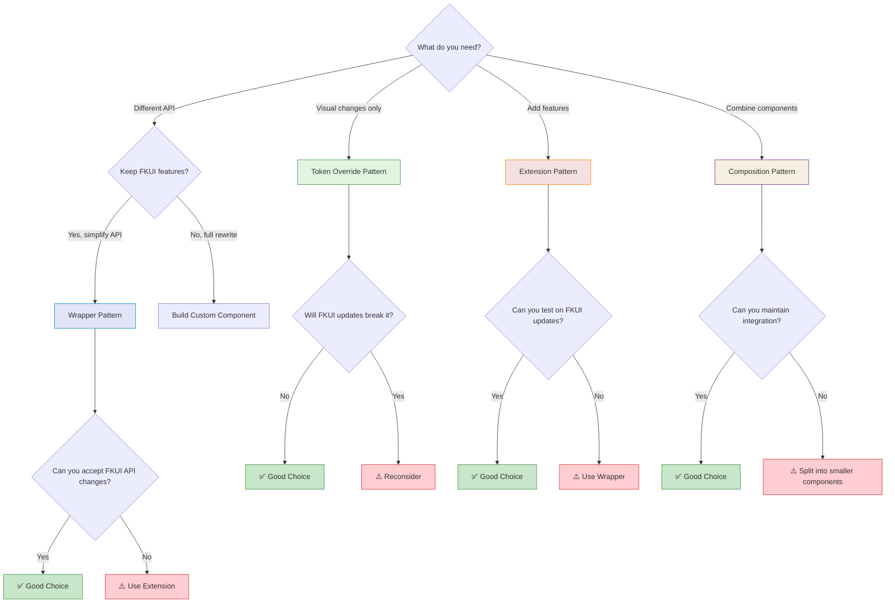
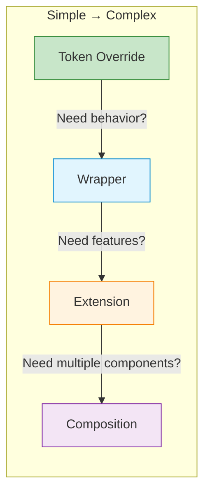
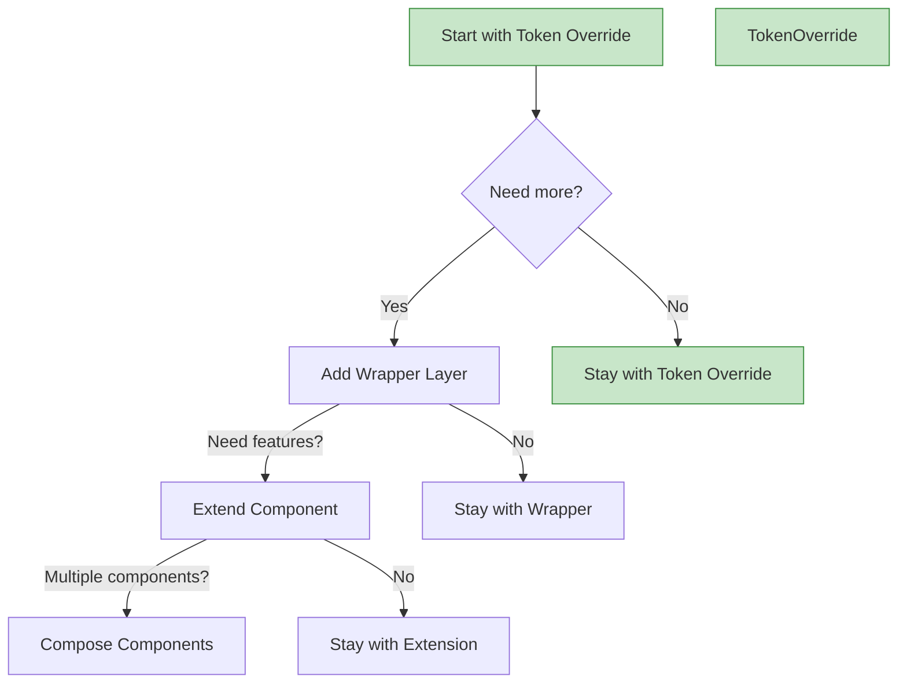

# Architectural Pattern Comparison

## Overview

EHMDS demonstrates four distinct architectural patterns for building on FKUI. Each pattern has different trade-offs and is suited for different use cases.

## Quick Reference

| Pattern | Complexity | Flexibility | Maintenance | Best For |
|---------|------------|------------|-------------|----------|
| **Token Override** | ⭐ Very Low | ⭐ Low | ⭐ Very Low | Visual changes only |
| **Wrapper** | ⭐⭐ Low-Medium | ⭐⭐⭐ High | ⭐⭐ Medium | API simplification |
| **Extension** | ⭐⭐⭐ Medium-High | ⭐⭐ Medium | ⭐⭐ Medium | Adding features |
| **Composition** | ⭐⭐⭐⭐ High | ⭐⭐⭐⭐ Very High | ⭐⭐⭐ High | Domain components |

## Decision Tree



### Decision Criteria by Dimension

| Pattern | TypeScript Support | Bundle Size Impact | FKUI Update Risk | Learning Curve | Testability |
|---------|-------------------|-------------------|-----------------|----------------|-------------|
| Token Override | ⭐⭐⭐ (passthrough) | +0KB | ⭐ Very Low | ⭐ Minimal | ⭐⭐ (CSS only) |
| Wrapper | ⭐⭐⭐⭐ (custom types) | +2-5KB | ⭐⭐ Low | ⭐⭐ Low | ⭐⭐⭐⭐ High |
| Extension | ⭐⭐⭐⭐⭐ (full control) | +5-10KB | ⭐⭐⭐ Medium | ⭐⭐⭐ Medium | ⭐⭐⭐ Medium |
| Composition | ⭐⭐⭐⭐⭐ (full control) | +10-20KB | ⭐⭐⭐⭐ High | ⭐⭐⭐⭐ High | ⭐⭐⭐⭐⭐ Very High |

## Detailed Comparison

### Token Override Pattern

**Example:** `EhmBadge` wrapping `FBadge`

```vue
<!-- Minimal code, just CSS overrides -->
<template>
  <FBadge v-bind="$attrs" class="ehm-badge">
    <slot />
  </FBadge>
</template>

<style scoped>
.ehm-badge:deep(.c-badge) {
  --fk-badge-background: var(--ehmds-color-primary) !important;
}
</style>
```

| Aspect | Details |
|--------|---------|
| **Code** | ~10 lines |
| **JS Logic** | None |
| **API Change** | None (passes through all props) |
| **Behavior Change** | None |
| **FKUI Updates** | Works automatically |
| **Risk** | Very Low |

### Wrapper/Facade Pattern

**Example:** `EhmCard` wrapping `FCard`

```vue
<template>
  <FCard :id="id" :focus-ref="errorRef">
    <template #header><slot name="header" /></template>
    <slot />
    <template #footer>
      <div class="ehm-card__footer">
        <slot name="footer" />
      </div>
    </template>
  </FCard>
</template>

<script setup>
const props = defineProps({
  variant: { type: String, default: "default" },
  hasError: { type: Boolean, default: false },
  errorRef: { type: HTMLElement, default: null },
});
</script>
```

| Aspect | Details |
|--------|---------|
| **Code** | ~50 lines |
| **JS Logic** | Props transformation, slot mapping |
| **API Change** | Yes (custom EHMDS API) |
| **Behavior Change** | Optional |
| **FKUI Updates** | May require testing |
| **Risk** | Low-Medium |

### Extension Pattern

**Example:** `EhmTextField` extending `FTextField`

```vue
<template>
  <div class="ehm-text-field">
    <label>{{ label }}</label>
    <div class="ehm-text-field__input-wrapper">
      <slot name="prefix" />
      <FTextField v-model="internalValue" v-bind="$attrs" />
      <span class="char-count">{{ length }}/{{ max }}</span>
    </div>
    <p class="helper">{{ helperText }}</p>
    <p class="error">{{ errorMessage }}</p>
  </div>
</template>

<script setup>
const props = defineProps({
  // All FTextField props...
  label: String,
  helperText: String,
  maxLength: Number,
  // ... more EHMDS additions
});
</script>
```

| Aspect | Details |
|--------|---------|
| **Code** | ~100 lines |
| **JS Logic** | State management, coordination |
| **API Change** | No (extends FKUI API) |
| **Behavior Change** | Yes (new features) |
| **FKUI Updates** | May require updates |
| **Risk** | Medium |

### Composition Pattern

**Example:** `EhmSearchBox` composing `FTextField`, `FCrudButton`, `FExpandable`

```vue
<template>
  <div class="ehm-search-box">
    <FExpandable v-model:is-open="isExpanded">
      <FTextField v-model="searchQuery" @keyup.enter="handleSearch" />
      <FCrudButton :action="'search'" @click="handleSearch" />
      <FCrudButton :action="'delete'" @click="handleClear" />
    </FExpandable>
    <slot name="results" :query="searchQuery" />
  </div>
</template>

<script setup>
const searchQuery = ref("");
const isExpanded = ref(false);
const handleSearch = () => emit("search", searchQuery.value);
// ... coordination logic
</script>
```

| Aspect | Details |
|--------|---------|
| **Code** | ~150 lines |
| **JS Logic** | State orchestration, event coordination |
| **API Change** | Yes (domain-specific API) |
| **Behavior Change** | Yes (new behavior) |
| **FKUI Updates** | Likely requires updates |
| **Risk** | Medium-High |

## When to Use Each Pattern



### Use Token Override When

- ✅ You only need to change colors, spacing, or fonts
- ✅ You want 100% FKUI API compatibility
- ✅ You want automatic FKUI updates
- ❌ You don't need behavior changes

### Use Wrapper When

- ✅ You want a simpler API than FKUI
- ✅ You need to enforce specific prop combinations
- ✅ You want to hide FKUI complexity
- ✅ You might add features later (can extend to Extension pattern)
- ❌ You don't need to add new features now

### Use Extension When

- ✅ You need FKUI features PLUS additional functionality
- ✅ You want to add helper text, validation, character counts, etc.
- ✅ You need to maintain full FKUI compatibility
- ✅ You want component-specific enhancements
- ❌ You don't need to combine multiple FKUI components

### Use Composition When

- ✅ You need to combine multiple FKUI components
- ✅ You're creating domain-specific UI patterns
- ✅ You want to reduce application boilerplate
- ✅ Multiple components need coordinated state
- ❌ You're not working with multiple FKUI components

## Migration Paths



You can evolve from simpler to more complex patterns:

1. Start with **Token Override** for visual customization
2. Add **Wrapper** if you need API changes
3. Extend to **Extension** if you need new features
4. Compose multiple components into **Composition** for domain patterns

## Real-World Examples

| EHMDS Component | Pattern | FKUI Components | Reason |
|-----------------|---------|-----------------|--------|
| `EhmBadge` | Token Override | `FBadge` | Only visual changes needed |
| `EhmCard` | Wrapper | `FCard` | Simpler API, custom variants |
| `EhmTextField` | Extension | `FTextField` | Add char count, helpers, errors |
| `EhmSearchBox` | Composition | `FTextField`, `FCrudButton`, `FExpandable` | Domain-specific search pattern |

## Summary Checklist

Use this checklist when deciding which pattern to use:

- [ ] Do I only need visual changes?
  - → **Token Override**

- [ ] Do I need a different API than FKUI provides?
  - → **Wrapper**

- [ ] Do I need to add features to a single FKUI component?
  - → **Extension**

- [ ] Do I need to combine multiple FKUI components?
  - → **Composition**

- [ ] Am I unsure what I need?
  - → Start with **Token Override**, evolve as needed

## Additional Resources

- [Token Override Pattern](./token-override.md)
- [Wrapper Pattern](./wrapper.md)
- [Extension Pattern](./extension.md)
- [Composition Pattern](./composition.md)
- [Accessibility Guide](./accessibility.md)
- [FKUI Update Strategy](./fkui-updates.md)
- [FKUI Documentation](https://designsystem.forsakringskassan.se/)
