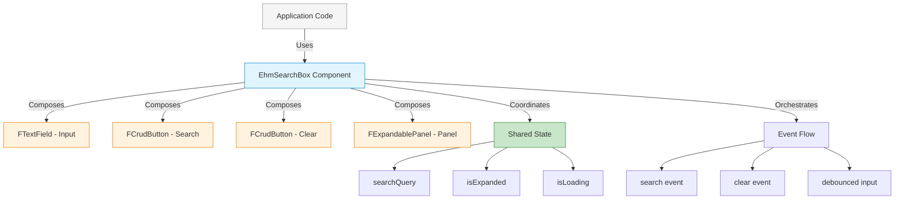
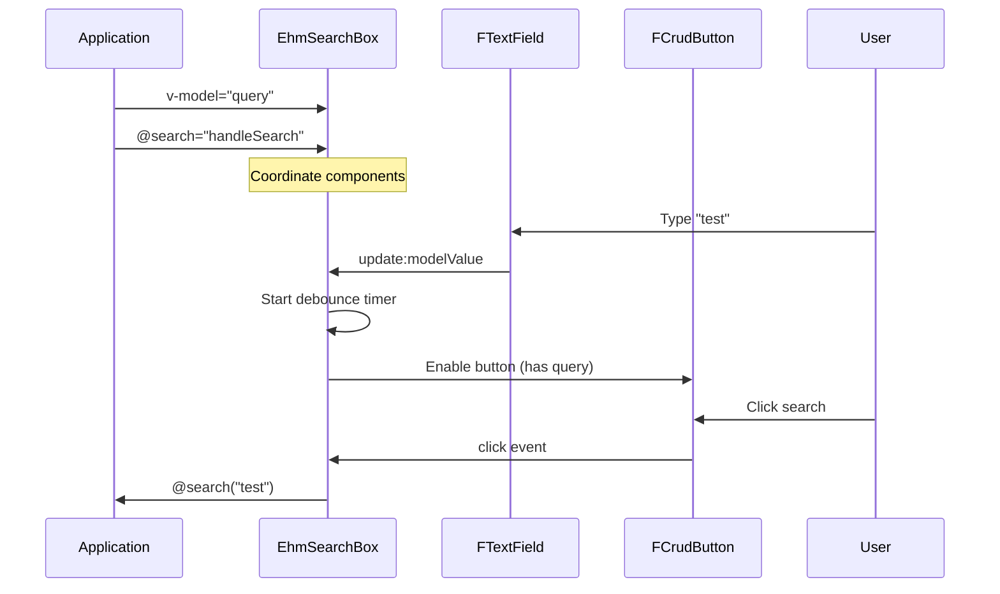

# Composition Pattern

## Overview

The **Composition Pattern** combines multiple FKUI components into a higher-level, domain-specific component. The composition component:

- Uses multiple FKUI components together
- Coordinates state and behavior between them
- Creates a cohesive, domain-focused API
- Manages complex user interactions

## When to Use

Use the Composition pattern when:

- You need to combine multiple FKUI components
- Creating domain-specific UI patterns (search, forms, etc.)
- Multiple FKUI components need to work together
- You want to reduce boilerplate in application code

## Implementation: EhmSearchBox

`EhmSearchBox` composes FKUI's `FTextField`, `FCrudButton`, and `FExpandablePanel`:

```vue
<template>
  <div class="ehm-search-box">
    <FExpandablePanel v-if="expandable" v-model:expanded="isExpanded">
      <FTextField
        v-model="searchQuery"
        :placeholder="placeholder"
        @keyup.enter="handleSearch"
      />
      <FCrudButton
        :action="'search'"
        @click="handleSearch"
      />
      <FCrudButton
        v-if="showClearButton"
        :action="'delete'"
        @click="handleClear"
      />
    </FExpandablePanel>

    <div v-if="$slots.results" class="ehm-search-box__results">
      <slot name="results" :query="searchQuery" :is-loading="isLoading" />
    </div>
  </div>
</template>
```

## Architecture Diagram



## Component Coordination

The composition pattern coordinates multiple FKUI components:



## State Management

```javascript
// Shared state managed by composition component
const searchQuery = ref(props.modelValue);
const isExpanded = ref(false);
const isLoading = ref(false);
const hasSearched = ref(false);

// Coordinate between components
const hasQuery = computed(() => {
  return searchQuery.value.trim().length >= props.minLength;
});

// Orchestrate debounced search
const handleSearchInput = (value) => {
  clearTimeout(debounceTimer);
  debounceTimer = setTimeout(() => {
    if (hasQuery.value) performSearch();
  }, props.debounce);
};
```

## Composed Components

| Component | Role | Props Used |
|-----------|------|------------|
| `FTextField` | Search input | v-model, placeholder, disabled |
| `FCrudButton` | Search action | action="search", disabled state |
| `FCrudButton` | Clear action | action="delete", conditional render |
| `FExpandablePanel` | Expand/collapse | v-model:expanded |

## Slots for Flexibility

```vue
<!-- Consumer can provide filter UI -->
<EhmSearchBox @search="fetchResults">
  <template #filters="{ query }">
    <FCheckbox v-model="filters.active">Active only</FCheckbox>
    <FSelect v-model="filters.sort">Sort by...</FSelect>
  </template>

  <!-- Consumer can render results -->
  <template #results="{ query, isLoading }">
    <FDataTable v-if="!isLoading" :data="results" />
    <FLoadingSpinner v-else />
  </template>
</EhmSearchBox>
```

## Pros and Cons

**Pros:**

- Reduces application boilerplate
- Consistent domain patterns
- Coordinated state management
- Reusable complex UI patterns
- Maintains FKUI accessibility

**Cons:**

- More complex implementation
- Tight coupling to FKUI components
- Less flexibility than direct FKUI usage
- Must understand all composed components

## Code Example

```vue
<template>
  <!-- EHMDS Composition API - single component, complex behavior -->
  <EhmSearchBox
    v-model="searchQuery"
    placeholder="Search users..."
    :debounce="300"
    :min-length="2"
    :expandable="true"
    @search="handleSearch"
  >
    <template #filters="{ query }">
      <FCheckbox v-model="filters.active">Active only</FCheckbox>
      <FSelect v-model="filters.role">Role</FSelect>
    </template>

    <template #results="{ query, isLoading }">
      <UserList :users="results" :loading="isLoading" />
    </template>
  </EhmSearchBox>
</template>
```

Without composition (application code would need):

```vue
<template>
  <!-- Without composition - much more application code -->
  <div class="search-container">
    <FExpandablePanel v-model:expanded="isExpanded">
      <FTextField v-model="query" @keyup.enter="handleSearch" />
      <FCrudButton
        action="search"
        :disabled="query.length < 2"
        @click="handleSearch"
      />
      <FCrudButton
        v-if="query"
        action="delete"
        @click="query = ''; handleClear()"
      />
      <!-- Plus: debounce logic, loading state, filter coordination... -->
    </FExpandablePanel>
  </div>
</template>

<script setup>
// Plus all this logic in every component that needs search:
const query = ref("");
const isExpanded = ref(false);
const isLoading = ref(false);
let debounceTimer = null;

watch(query, (val) => {
  clearTimeout(debounceTimer);
  debounceTimer = setTimeout(() => {
    if (val.length >= 2) handleSearch();
  }, 300);
});

// ... repeated in every search component
</script>
```

## When to Choose Composition Over Wrapper/Extension

| Pattern | Best For |
|---------|----------|
| **Wrapper** | Simplify single FKUI component's API |
| **Extension** | Add features to single FKUI component |
| **Composition** | Combine multiple FKUI components into domain pattern |

The composition pattern shines when you find yourself repeatedly using the same set of FKUI components together in your application code.
