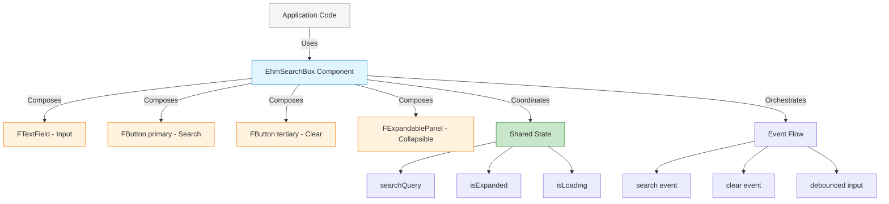
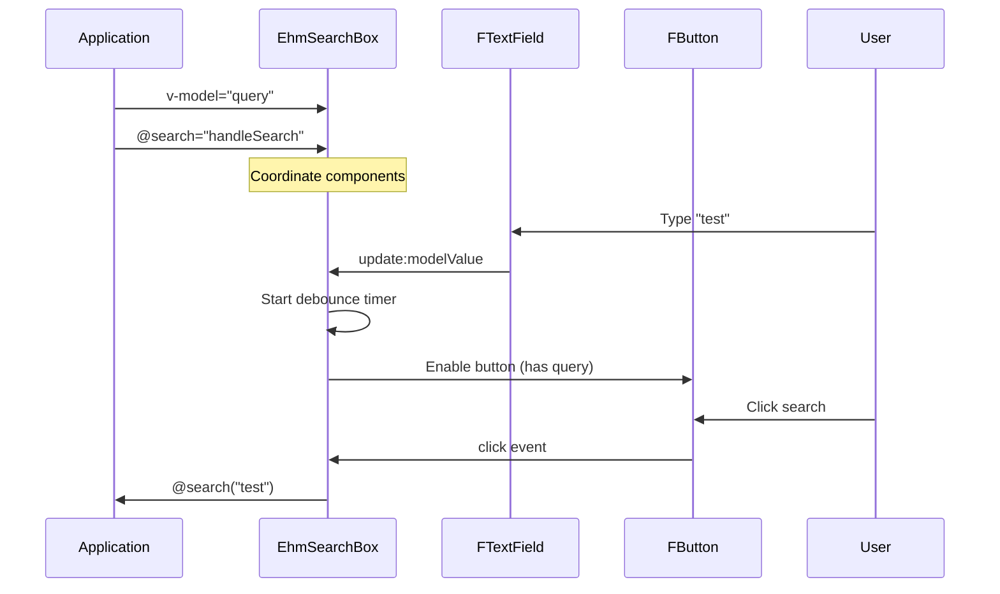

# Composition Pattern

## Overview

The **Composition Pattern** combines multiple FKUI components into a higher-level, domain-specific component. The composition component:

- Uses multiple FKUI components together
- Coordinates state and behavior between them
- Creates a cohesive, domain-focused API
- Manages complex user interactions

## When to Use

Use the Composition pattern when:

- You need to combine multiple FKUI components
- Creating domain-specific UI patterns (search, forms, etc.)
- Multiple FKUI components need to work together
- You want to reduce boilerplate in application code

## Implementation: EhmSearchBox

`EhmSearchBox` composes four FKUI components — `FTextField`, two `FButton`
instances (search + clear actions), and `FExpandablePanel` (the collapsible
"advanced search" container):

```vue
<template>
  <div class="ehm-search-box">
    <!-- FExpandablePanel renders its own a11y-correct toggle and manages
         aria-expanded / aria-controls itself. We drive it via :expanded. -->
    <FExpandablePanel
      v-if="expandable"
      :expanded="isExpanded"
      header-tag="h3"
      @toggle="toggleExpand"
    >
      <template #title>{{ placeholder || "Search" }}</template>

      <!-- The composed search row -->
      <div class="ehm-search-box__content">
        <FTextField
          v-model="searchQuery"
          :placeholder="placeholder"
          :disabled="disabled"
          @keyup.enter="handleSearch"
        />
        <FButton
          variant="primary"
          size="small"
          :disabled="isButtonDisabled"
          @click="handleSearch"
        >
          <span v-if="showIcon" aria-hidden="true">🔍</span>
          <template v-else>Sök</template>
        </FButton>
        <FButton
          v-if="showClearButton"
          variant="tertiary"
          size="small"
          aria-label="Rensa"
          @click="handleClear"
        >
          <span aria-hidden="true">✕</span>
        </FButton>
      </div>
    </FExpandablePanel>

    <!-- Non-expandable variant composes the same row without FExpandablePanel -->
    <div v-else class="ehm-search-box__content">
      <!-- FTextField + FButton ×2, as above -->
    </div>

    <div v-if="$slots.results && hasSearched" class="ehm-search-box__results">
      <slot name="results" :query="searchQuery" :is-loading="isLoading" />
    </div>
  </div>
</template>

<script setup>
import { FButton, FExpandablePanel, FTextField } from "@fkui/vue";
</script>
```

> **Note on `FButton` variants.** FKUI's `FButton` accepts `variant` of
> `primary | secondary | tertiary` (there is **no** `discrete` variant). The
> clear action uses `variant="tertiary"`. Do **not** reach for `FCrudButton`
> here — it is deprecated and tied to a parent `FCrudDataset` with only
> `delete`/`modify` actions.

## Architecture Diagram


```mermaid
graph TD
    App[Application Code] -->|Uses| EHMDS[EhmSearchBox Component]
    EHMDS -->|Composes| FKUI1[FTextField - Input]
    EHMDS -->|Composes| FKUI2[FButton primary - Search]
    EHMDS -->|Composes| FKUI3[FButton tertiary - Clear]
    EHMDS -->|Composes| FKUI4[FExpandablePanel - Collapsible]
    EHMDS -->|Coordinates| State[Shared State]
    EHMDS -->|Orchestrates| Events[Event Flow]

    State --> Query[searchQuery]
    State --> Expanded[isExpanded]
    State --> Loading[isLoading]

    Events --> Search[search event]
    Events --> Clear[clear event]
    Events --> Debounce[debounced input]

    style EHMDS fill:#e1f5fe,stroke:#0288d1
    style FKUI1 fill:#fff3e0,stroke:#f57c00
    style FKUI2 fill:#fff3e0,stroke:#f57c00
    style FKUI3 fill:#fff3e0,stroke:#f57c00
    style FKUI4 fill:#fff3e0,stroke:#f57c00
    style State fill:#c8e6c9,stroke:#388e3c
    style App fill:#f5f5f5,stroke:#999
```

## Component Coordination

The composition pattern coordinates multiple FKUI components:


```mermaid
sequenceDiagram
    participant App as Application
    participant EHMDS as EhmSearchBox
    participant FText as FTextField
    participant FBtn as FButton

    App->>EHMDS: v-model="query"
    App->>EHMDS: @search="handleSearch"

    Note over EHMDS: Coordinate components

    User->>FText: Type "test"
    FText->>EHMDS: update:modelValue
    EHMDS->>EHMDS: Start debounce timer
    EHMDS->>FBtn: Enable button (has query)

    User->>FBtn: Click search
    FBtn->>EHMDS: click event
    EHMDS->>App: @search("test")
```

## State Management

```javascript
// Shared state managed by composition component
const searchQuery = ref(props.modelValue);
const isExpanded = ref(false);
const isLoading = ref(false);
const hasSearched = ref(false);

// Coordinate between components
const hasQuery = computed(() => {
  return searchQuery.value.trim().length >= props.minLength;
});

// Orchestrate debounced search
const handleSearchInput = (value) => {
  clearTimeout(debounceTimer);
  debounceTimer = setTimeout(() => {
    if (hasQuery.value) performSearch();
  }, props.debounce);
};
```

## Composed Components

| Component | Role | Props Used |
|-----------|------|------------|
| `FTextField` | Search input | v-model, placeholder, disabled |
| `FButton` (`primary`) | Search action | variant, size, disabled |
| `FButton` (`tertiary`) | Clear action | variant, size, conditional render |
| `FExpandablePanel` | Expand/collapse container | `:expanded` (driven) + `@toggle` |

## Slots for Flexibility

```vue
<!-- Consumer can provide filter UI -->
<EhmSearchBox @search="fetchResults">
  <template #filters="{ query }">
    <FCheckbox v-model="filters.active">Active only</FCheckbox>
    <FSelect v-model="filters.sort">Sort by...</FSelect>
  </template>

  <!-- Consumer can render results -->
  <template #results="{ query, isLoading }">
    <FDataTable v-if="!isLoading" :data="results" />
    <FLoadingSpinner v-else />
  </template>
</EhmSearchBox>
```

## Pros and Cons

**Pros:**

- Reduces application boilerplate
- Consistent domain patterns
- Coordinated state management
- Reusable complex UI patterns
- Maintains FKUI accessibility

**Cons:**

- More complex implementation
- Tight coupling to FKUI components
- Less flexibility than direct FKUI usage
- Must understand all composed components

## Risks &amp; When NOT to Use

**Update risk is amplified.** A composition depends on the public surface of
*every* composed component. If FKUI changes `FButton`'s variant names,
`FExpandablePanel`'s event contract, or `FTextField`'s slots, this component
breaks in more places than a single-component pattern would. Budget for
integration tests (the test suite asserts that each FKUI component is actually
rendered) and re-verify on every FKUI upgrade.

**Do not use Composition when:**

- You are only restyling a single component — use **Token Override**.
- You are simplifying one component's API — use **Wrapper/Facade**.
- The "composition" would actually only wrap a single FKUI component — that is
  a Wrapper, not a Composition. (Composing raw HTML elements alongside one FKUI
  component is a weaker form; prefer to compose real FKUI components so the
  a11y and behaviour of *each piece* come from the parent system.)
- You need to migrate between two design systems — an **Adapter/Bridge** is a
  better fit, because the goal is translation rather than orchestration.

**Accessibility note.** Delegating a11y to the composed FKUI components is a
strength of this pattern — `FExpandablePanel` manages `aria-expanded`/
`aria-controls`, and `FButton` renders a real focusable `<button>`. Do not
re-implement those behaviours around the composed components.

## Code Example

```vue
<template>
  <!-- EHMDS Composition API - single component, complex behavior -->
  <EhmSearchBox
    v-model="searchQuery"
    placeholder="Search users..."
    :debounce="300"
    :min-length="2"
    :expandable="true"
    @search="handleSearch"
  >
    <template #filters="{ query }">
      <FCheckbox v-model="filters.active">Active only</FCheckbox>
      <FSelect v-model="filters.role">Role</FSelect>
    </template>

    <template #results="{ query, isLoading }">
      <UserList :users="results" :loading="isLoading" />
    </template>
  </EhmSearchBox>
</template>
```

Without composition (application code would need):

```vue
<template>
  <!-- Without composition - much more application code -->
  <div class="search-container">
    <FExpandablePanel :expanded="isExpanded" @toggle="isExpanded = !isExpanded">
      <FTextField v-model="query" @keyup.enter="handleSearch" />
      <FButton
        variant="primary"
        size="small"
        :disabled="query.length < 2"
        @click="handleSearch"
      />
      <FButton
        v-if="query"
        variant="tertiary"
        size="small"
        aria-label="Rensa"
        @click="query = ''; handleClear()"
      />
      <!-- Plus: debounce logic, loading state, filter coordination... -->
    </FExpandablePanel>
  </div>
</template>

<script setup>
// Plus all this logic in every component that needs search:
const query = ref("");
const isExpanded = ref(false);
const isLoading = ref(false);
let debounceTimer = null;

watch(query, (val) => {
  clearTimeout(debounceTimer);
  debounceTimer = setTimeout(() => {
    if (val.length >= 2) handleSearch();
  }, 300);
});

// ... repeated in every search component
</script>
```

## When to Choose Composition Over Wrapper/Extension

| Pattern | Best For |
|---------|----------|
| **Wrapper** | Simplify single FKUI component's API |
| **Extension** | Add features to single FKUI component |
| **Composition** | Combine multiple FKUI components into domain pattern |

The composition pattern shines when you find yourself repeatedly using the same set of FKUI components together in your application code.

## Industry Context: The "Recipe" Pattern

As defined by Brad Frost, **Composition** is the act of combining "Atoms" (FKUI components) into "Recipes" or "Molecules" (EHMDS domain components). It is a scalable approach for building product-specific UI without bloating the base design system — though, as the risks above note, the coupling it introduces is its real cost.
