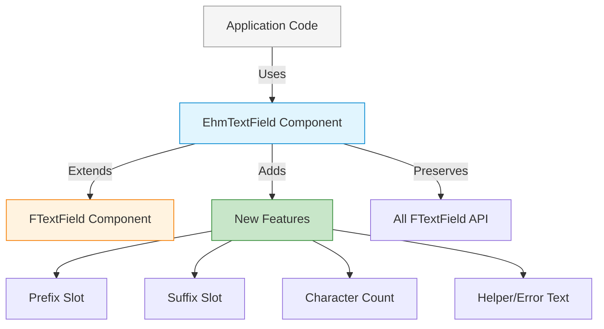

# Extension Pattern

## Overview

The **Extension Pattern** extends an FKUI component's functionality while preserving all its original capabilities. The extension component:

- Uses FKUI components as the foundation
- Adds new props, slots, and features
- Preserves all FKUI functionality
- Coordinates between FKUI component and new features

## When to Use

Use the Extension pattern when:

- You need FKUI's features plus additional functionality
- You want to add utility features (char count, helpers, etc.)
- You need to enhance FKUI without breaking existing behavior
- You want to maintain full FKUI compatibility

## Implementation: EhmTextField

`EhmTextField` extends FKUI's `FTextField` component:

```vue
<template>
  <div class="ehm-text-field">
    <label>{{ label }}<span v-if="required">*</span></label>
    <div class="ehm-text-field__input-wrapper">
      <!-- EHMDS additions: prefix/suffix slots -->
      <span v-if="$slots.prefix" class="ehm-text-field__prefix">
        <slot name="prefix" />
      </span>

      <!-- Extended FKUI component -->
      <FTextField
        v-model="internalValue"
        v-bind="$attrs"
        @update:model-value="handleUpdate"
      />

      <!-- EHMDS additions: character count -->
      <span class="ehm-text-field__charcount">
        {{ currentLength }}/{{ maxLength }}
      </span>
    </div>

    <!-- EHMDS additions: helper and error text -->
    <p v-if="helperText">{{ helperText }}</p>
    <p v-if="errorMessage">{{ errorMessage }}</p>
  </div>
</template>
```

## Architecture Diagram



## Extended Features

| Feature | Type | Description |
|---------|------|-------------|
| `label` prop | New | Adds label element with required indicator |
| `helperText` prop | New | Adds helper text below input |
| `errorMessage` prop | New | Adds error message display |
| `maxLength` prop | New | Enforces character limit |
| `showCharacterCount` prop | New | Shows character counter |
| `#prefix` slot | New | Content before input |
| `#suffix` slot | New | Content after input |
| All FTextField props | Preserved | Full FKUI compatibility |

## Props Comparison

```javascript
// FKUI FTextField props
{
  id, modelValue, type, placeholder, disabled,
  readonly, required, inline, labelWidth,
  inputWidth, formatter, parser, ...
}

// EHMDS EhmTextField props (includes all FTextField props)
{
  // ... all FTextField props ...
  // Plus EHMDS extensions:
  label, helperText, errorMessage, hasError,
  maxLength, showCharacterCount, variant
}
```

## Pros and Cons

**Pros:**

- Preserves all FKUI functionality
- Adds new features without breaking changes
- Maintains FKUI compatibility
- Can layer multiple extensions

**Cons:**

- Larger component size
- More complex state management
- Potential for prop naming conflicts
- Must synchronize with FKUI updates

## Code Example

```vue
<template>
  <!-- EHMDS Extended API - includes FKUI features plus more -->
  <EhmTextField
    v-model="name"
    label="Full Name"
    helperText="Enter your first and last name"
    :max-length="50"
    :show-character-count="true"
    :error-message="nameError"
    :has-error="!!nameError"
    placeholder="Jane Doe"
    required
  >
    <template #prefix>
      <icon-user />
    </template>
  </EhmTextField>
</template>
```

Compared to using FKUI directly:

```vue
<template>
  <!-- FKUI API - only has basic features -->
  <FTextField
    v-model="name"
    id="name-field"
    placeholder="Jane Doe"
  />
  <!-- Need to manually add: label, error, char count, etc. -->
</template>
```

## Extension Strategy

The extension pattern follows these principles:

1. **Preserve Original API**: All FKUI props work as-is
2. **Additive Changes**: Only add, never remove FKUI features
3. **Smart Defaults**: Provide sensible defaults for new props
4. **Coordination**: Manage state between FKUI and new features
5. **Accessibility**: Maintain WCAG compliance when adding features
