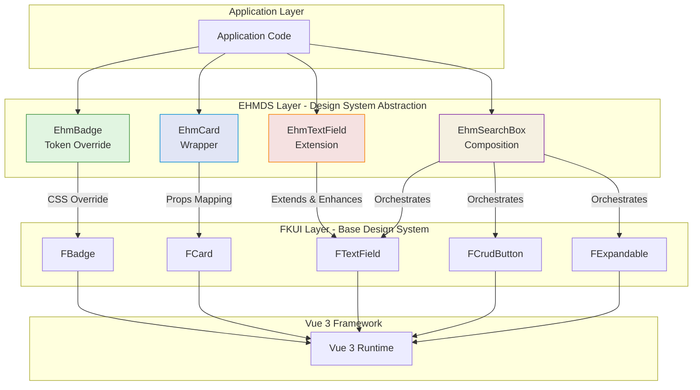
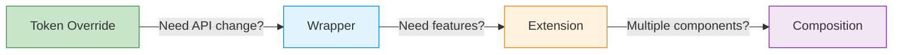

# EHMDS Architecture Overview

## Purpose

EHMDS (EHM Design System) is a **proof-of-concept design system** built on top of [FKUI (Försäkringskassan Design System)](https://designsystem.forsakringskassan.se/). Its purpose is to **explore, demonstrate, and compare architectural approaches** for building one design system on another.

## Primary Hypothesis

**A layered architecture is the most effective pattern** for building a design system on top of another design system.

## The Layered Architecture



## Four Architectural Patterns

EHMDS demonstrates four distinct patterns for building on FKUI:

### 1. Token Override Pattern 🎨

**Minimal code, visual changes only**

Uses FKUI components as-is, overriding only CSS custom properties for visual changes.

- **Component:** `EhmBadge` (wraps `FBadge`)
- **Code:** ~10 lines (mostly CSS)
- **Use Case:** When you only need to change colors, fonts, or spacing
- **Maintenance:** Very low - automatic FKUI updates

```vue
<EhmBadge status="brand">New Feature</EhmBadge>
```

**[Learn more →](./token-override.md)**

---

### 2. Wrapper/Facade Pattern 📦

**Simplified API, same component**

Wraps FKUI components with a simplified, customized EHMDS API.

- **Component:** `EhmCard` (wraps `FCard`)
- **Code:** ~50 lines
- **Use Case:** When you want a simpler or different API than FKUI
- **Maintenance:** Low - may need testing on FKUI updates

```vue
<EhmCard variant="elevated" :has-error="hasError">
  <template #header>Title</template>
  Content here
</EhmCard>
```

**[Learn more →](./wrapper.md)**

---

### 3. Extension Pattern ➕

**FKUI features + EHMDS enhancements**

Extends FKUI components with additional features while preserving all original functionality.

- **Component:** `EhmTextField` (extends `FTextField`)
- **Code:** ~100 lines
- **Use Case:** When you need FKUI's features plus additional functionality
- **Maintenance:** Medium - may need updates on FKUI changes

```vue
<EhmTextField
  v-model="name"
  label="Full Name"
  :max-length="50"
  show-character-count
  helper-text="Enter your name"
/>
```

**[Learn more →](./extension.md)**

---

### 4. Composition Pattern 🧩

**Multiple FKUI components, one domain component**

Combines multiple FKUI components into a higher-level, domain-specific component.

- **Component:** `EhmSearchBox` (composes `FTextField` + `FCrudButton` + `FExpandablePanel`)
- **Code:** ~150 lines
- **Use Case:** When you need to combine multiple FKUI components into a pattern
- **Maintenance:** High - likely needs updates on FKUI changes

```vue
<EhmSearchBox
  v-model="searchQuery"
  :debounce="300"
  @search="handleSearch"
>
  <template #filters="{ query }">
    <FCheckbox v-model="filters.active">Active only</FCheckbox>
  </template>
  <template #results="{ query, isLoading }">
    <UserList :users="results" />
  </template>
</EhmSearchBox>
```

**[Learn more →](./composition.md)**

---

## Pattern Comparison

| Pattern | Complexity | Flexibility | Maintenance | Best For |
|---------|:----------:|:----------:|:-----------:|----------|
| **Token Override** | ⭐ | ⭐ | ⭐ | Visual changes |
| **Wrapper** | ⭐⭐ | ⭐⭐⭐ | ⭐⭐ | API changes |
| **Extension** | ⭐⭐⭐ | ⭐⭐ | ⭐⭐ | Adding features |
| **Composition** | ⭐⭐⭐⭐ | ⭐⭐⭐⭐ | ⭐⭐⭐ | Domain patterns |

**[Detailed comparison →](./comparison.md)**

## Key Design Decisions

### Decision 1: Layered Architecture

We chose a **layered architecture** where EHMDS sits between the application and FKUI. This provides:

- **Consistency:** Single source of design patterns
- **Flexibility:** Can swap FKUI without changing application code
- **Evolution:** Can graduate components from one pattern to another

### Decision 2: Multiple Patterns

Instead of choosing one pattern, EHMDS **demonstrates all four patterns** because:

- **Different needs:** Different components have different requirements
- **Realistic:** Production systems use multiple patterns
- **Educational:** Shows trade-offs of each approach

### Decision 3: Prefix Convention

EHMDS components use the `Ehm` prefix (e.g., `EhmCard`, `EhmTextField`) to:

- **Distinguish from FKUI:** Clear which library a component comes from
- **Avoid conflicts:** No naming collisions with FKUI components
- **Visual clarity:** Easy to see layer boundaries in code

## Component Catalog

| EHMDS Component | Pattern | FKUI Component | Status |
|-----------------|---------|----------------|--------|
| `EhmBadge` | Token Override | `FBadge` | ✅ Implemented |
| `EhmCard` | Wrapper | `FCard` | ✅ Implemented |
| `EhmTextField` | Extension | `FTextField` | ✅ Implemented |
| `EhmSearchBox` | Composition | `FTextField` + `FCrudButton` + `FExpandablePanel` | ✅ Implemented |

## Migration Path

Start simple, evolve as needed:



## Project Structure

```
ehmds-on-fkui-test/
├── docs/
│   └── architecture/          # This documentation
│       ├── overview.md        # This file
│       ├── comparison.md      # Pattern comparison
│       ├── token-override.md  # Token override pattern
│       ├── wrapper.md         # Wrapper pattern
│       ├── extension.md       # Extension pattern
│       └── composition.md     # Composition pattern
├── src/
│   └── components/
│       ├── wrapper/           # Wrapper pattern components
│       │   └── EhmCard.vue
│       ├── extension/         # Extension pattern components
│       │   └── EhmTextField.vue
│       ├── composition/       # Composition pattern components
│       │   └── EhmSearchBox.vue
│       └── token-override/    # Token override components
│           └── EhmBadge.vue
└── CLAUDE.md                  # Project documentation
```

## Getting Started

### Installation

```bash
npm install @ehmds/design-system
```

### Basic Usage

```javascript
import { createApp } from 'vue'
import EHMDS from '@ehmds/design-system'
import App from './App.vue'

const app = createApp(App)
app.use(EHMDS)
app.mount('#app')
```

### Using Components

```vue
<template>
  <div>
    <!-- Token Override -->
    <EhmBadge status="brand">New</EhmBadge>

    <!-- Wrapper -->
    <EhmCard variant="elevated">
      Card content
    </EhmCard>

    <!-- Extension -->
    <EhmTextField
      v-model="name"
      label="Name"
      :max-length="50"
      show-character-count
    />

    <!-- Composition -->
    <EhmSearchBox
      v-model="query"
      @search="handleSearch"
    />
  </div>
</template>
```

## FKUI Compatibility

EHMDS requires FKUI as a peer dependency:

```json
{
  "peerDependencies": {
    "@fkui/vue": "^6.12.0",
    "@fkui/design": "^6.12.0",
    "@fkui/logic": "^6.12.0",
    "vue": "^3.5.0"
  }
}
```

## Contributing

When adding new components to EHMDS:

1. **Choose the appropriate pattern** based on your needs
2. **Follow the conventions** for that pattern
3. **Document your decision** in an ADR (Architecture Decision Record)
4. **Add to this catalog** with the pattern used
5. **Test against FKUI updates** to ensure compatibility

## References

- [FKUI Documentation](https://designsystem.forsakringskassan.se/)
- [FKUI GitHub](https://github.com/Forsakringskassan/designsystem)
- [Vue 3 Documentation](https://vuejs.org/)
- [Accessibility Guide](./accessibility.md)
- [FKUI Update Strategy](./fkui-updates.md)

## License

MIT - See [LICENSE](../../LICENSE) for details.
