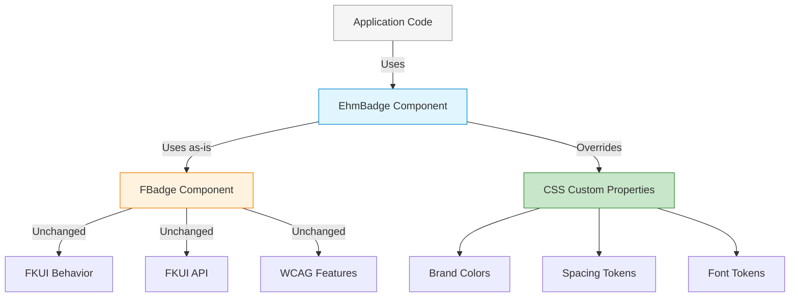
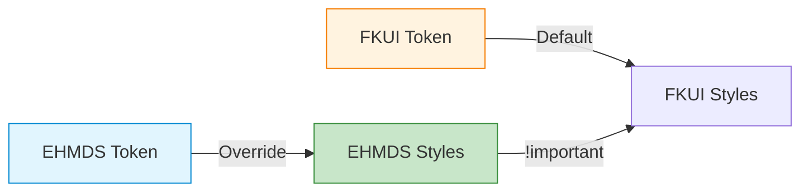
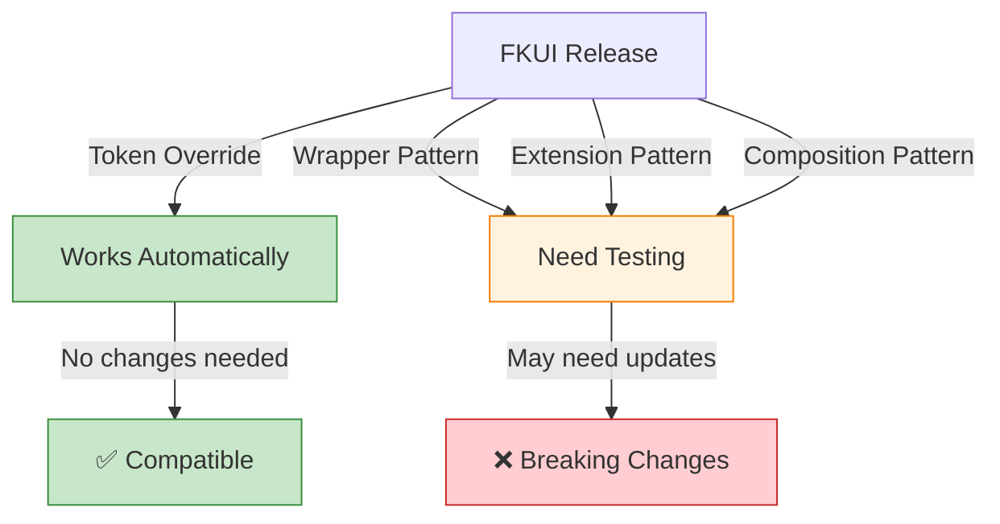

# Token Override Pattern

## Overview

The **Token Override Pattern** uses FKUI components as-is, only overriding CSS custom properties (design tokens) to change appearance. This approach:

- Uses FKUI components without modification
- Changes only CSS variables for styling
- Preserves all FKUI behavior and APIs
- Minimal code, maximum compatibility

## When to Use

Use the Token Override pattern when:

- You like FKUI's behavior but want different styling
- You only need visual changes, not behavioral changes
- You want minimal maintenance overhead
- You need 100% FKUI compatibility

## Implementation: EhmBadge

`EhmBadge` uses FKUI's `FBadge` with CSS token overrides:

```vue
<template>
  <!-- Use FBadge as-is, just override CSS variables -->
  <FBadge
    v-bind="$attrs"
    :status="mappedStatus"
    :inverted="inverted"
    class="ehm-badge"
  >
    <slot />
  </FBadge>
</template>

<style scoped>
/* Override FKUI's CSS variables with EHMDS tokens */
.ehm-badge:deep(.c-badge--status-default) {
  --fk-badge-background: var(--ehmds-color-primary, #2563eb) !important;
  --fk-badge-color: var(--ehmds-color-primary-contrast, #ffffff) !important;
}
</style>
```

## Architecture Diagram



## Token Override Strategy



## CSS Token Mapping

| FKUI Token | EHMDS Override | Status |
|------------|----------------|--------|
| `--fk-badge-background` | `var(--ehmds-color-primary)` | ✅ Mapped |
| `--fk-badge-color` | `var(--ehmds-color-primary-contrast)` | ✅ Mapped |
| Component behavior | Unchanged | ✅ Preserved |
| Accessibility features | Unchanged | ✅ Preserved |

## Implementation Example

```vue
<!-- EhmBadge.vue -->
<template>
  <FBadge
    v-bind="$attrs"  <!-- Pass all attrs through -->
    :status="mappedStatus"
    :inverted="inverted"
    class="ehm-badge"
  >
    <slot />
  </FBadge>
</template>

<script setup>
import { computed } from "vue";
import { FBadge } from "@fkui/vue";

// Optional: Map EHMDS status names to FKUI status names
const mappedStatus = computed(() => {
  const statusMap = {
    brand: "default",   // EHMDS "brand" → FKUI "default" with custom colors
    neutral: "info",    // EHMDS "neutral" → FKUI "info" with custom colors
  };
  return statusMap[props.status] || props.status;
});
</script>

<style scoped>
/* Only override CSS variables - nothing else! */
.ehm-badge:deep(.c-badge--status-default) {
  --fk-badge-background: var(--ehmds-color-primary) !important;
  --fk-badge-color: var(--ehmds-color-primary-contrast) !important;
}

.ehm-badge:deep(.c-badge--status-info) {
  --fk-badge-background: var(--ehmds-color-neutral-200) !important;
  --fk-badge-color: var(--ehmds-color-text-primary) !important;
}
</style>
```

## Token Override Principles

1. **Use `!important`**: FKUI's styles may have higher specificity
2. **Target deep**: Use `:deep()` to reach FKUI's internal classes
3. **Override only**: Don't add new CSS rules, just override variables
4. **Test accessibility**: Ensure overrides don't break WCAG compliance
5. **Document mappings**: Keep track of which tokens map to what

## Pros and Cons

**Pros:**

- Minimal code (just CSS overrides)
- 100% FKUI API compatibility
- Automatic FKUI updates work
- No behavioral changes to test
- Low maintenance overhead

**Cons:**

- Limited to visual changes only
- Must understand FKUI's internal class names
- CSS specificity can be tricky
- `!important` required
- Can't change component behavior

## Code Comparison

**With Token Override:**

```vue
<template>
  <!-- Simple! Just CSS overrides -->
  <EhmBadge status="brand">New Feature</EhmBadge>
</template>

<script setup>
// Almost no JavaScript code!
import { EhmBadge } from "@ehmds/design-system";
</script>
```

**Without Token Override (would need custom component):**

```vue
<template>
  <!-- Complex! Need to recreate badge behavior -->
  <span
    :class="badgeClasses"
    :aria-hidden="decorative"
  >
    <slot />
  </span>
</template>

<script setup>
// Need to recreate all badge logic:
const props = defineProps({
  status: { type: String, default: "default" },
  inverted: { type: Boolean, default: false },
  decorative: { type: Boolean, default: false },
});

const badgeClasses = computed(() => [
  "badge",
  `badge--${props.status}`,
  { "badge--inverted": props.inverted },
]);
// ... plus all accessibility logic
</script>

<style scoped>
/* Need to recreate all badge styles! */
.badge {
  display: inline-flex;
  align-items: center;
  /* ... many lines of CSS ... */
}
/* ... plus all variant styles ... */
</style>
```

## Token Override vs Other Patterns

| Pattern | Lines of Code | API Change | Behavior Change | Maintenance |
|---------|---------------|------------|-----------------|-------------|
| **Token Override** | ~10 | No | No | Very Low |
| **Wrapper** | ~50 | Yes | Optional | Medium |
| **Extension** | ~100 | No | Yes | Medium |
| **Composition** | ~150 | Yes | Yes | High |

## When FKUI Updates



## Best Practices

1. **Start with token override** if you only need visual changes
2. **Document FKUI class names** you're targeting (they may change)
3. **Test accessibility** after overrides (contrast, focus indicators)
4. **Use CSS custom properties** for your token values
5. **Consider naming** - prefix with "ehm-" to distinguish from FKUI
6. **Test in dark mode** and high contrast mode
7. **Validate with FKUI's updates** each release

## Anti-Patterns to Avoid

- ❌ **Don't** override non-token properties (padding, margin, etc.)
- ❌ **Don't** use complex selectors that may break with FKUI updates
- ❌ **Don't** override behavior with CSS (pointer-events, etc.)
- ❌ **Don't** forget `!important` on token overrides
- ❌ **Don't** override without understanding FKUI's base styles
