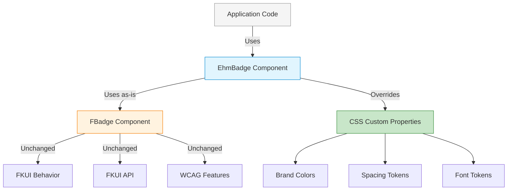
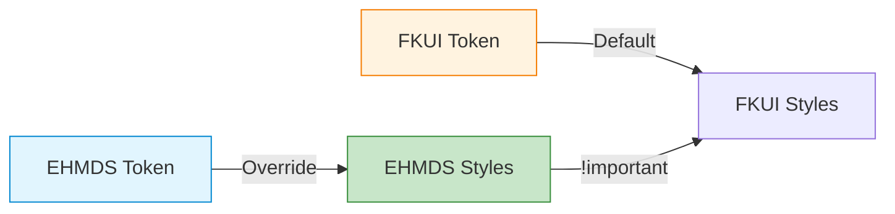
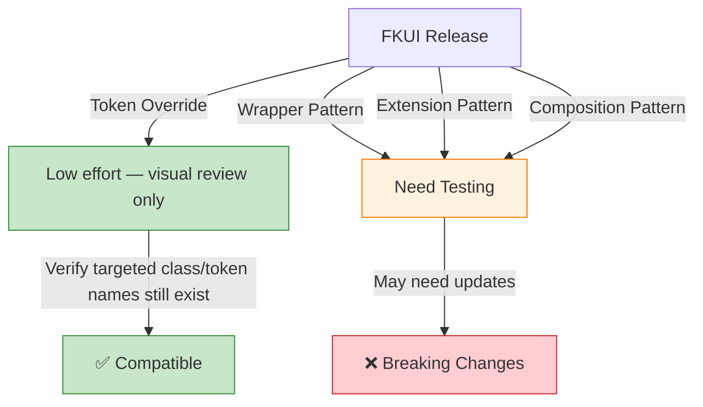

# Token Override Pattern

## Overview

The **Token Override Pattern** uses FKUI components as-is, only overriding CSS custom properties (design tokens) to change appearance. This approach:

- Uses FKUI components without modification
- Changes only CSS variables for styling
- Preserves all FKUI behavior and APIs
- Minimal code, maximum compatibility

## When to Use

Use the Token Override pattern when:

- You like FKUI's behavior but want different styling
- You only need visual changes, not behavioral changes
- You want minimal maintenance overhead
- You need 100% FKUI compatibility

## Implementation: EhmBadge

`EhmBadge` is a **pure Token Override**: it declares NO props of its own and
adds NO behavior. It renders FKUI's `FBadge` as-is (all attributes fall through
to `FBadge`) and attaches a single `.ehm-badge` class hook so CSS can override
FKUI's design tokens on the real FKUI status classes:

```vue
<template>
  <!-- Pure Token Override: no props declared, all attrs fall through to FBadge -->
  <FBadge class="ehm-badge">
    <slot />
  </FBadge>
</template>

<style scoped>
/* Override FKUI's CSS variables on its REAL status classes. */
.ehm-badge:deep(.badge--default) {
  --fkds-color-feedback-background-neutral-strong: var(--ehmds-color-primary, #2563eb) !important;
  --fkds-color-feedback-border-neutral-strong: var(--ehmds-color-primary, #2563eb) !important;
  --fkds-color-text-inverted: var(--ehmds-color-primary-contrast, #ffffff) !important;
}
</style>
```

There is no `status` prop, no `inverted` prop, no `BadgeStatus` type, and no
status-name mapping in this component — callers pass the native `FBadge` status
(`default`, `info`, `success`, `warning`, `error`) straight through.

## Architecture Diagram


```mermaid
graph TD
    App[Application Code] -->|Uses| EHMDS[EhmBadge Component]
    EHMDS -->|Uses as-is| FKUI[FBadge Component]
    EHMDS -->|Overrides| Tokens[CSS Custom Properties]
    Tokens --> Brand[Brand Colors]
    Tokens --> Spacing[Spacing Tokens]
    Tokens --> Typography[Font Tokens]

    FKUI -->|Unchanged| Behavior[FKUI Behavior]
    FKUI -->|Unchanged| API[FKUI API]
    FKUI -->|Unchanged| Accessibility[WCAG Features]

    style EHMDS fill:#e1f5fe,stroke:#0288d1
    style FKUI fill:#fff3e0,stroke:#f57c00
    style Tokens fill:#c8e6c9,stroke:#388e3c
    style App fill:#f5f5f5,stroke:#999
```

## Token Override Strategy


```mermaid
graph LR
    FKUI_Token[FKUI Token] -->|Default| FKUI_Styles[FKUI Styles]
    EHMDS_Token[EHMDS Token] -->|Override| EHMDS_Styles[EHMDS Styles]
    EHMDS_Styles -->|!important| FKUI_Styles

    style FKUI_Token fill:#fff3e0,stroke:#f57c00
    style EHMDS_Token fill:#e1f5fe,stroke:#0288d1
    style EHMDS_Styles fill:#c8e6c9,stroke:#388e3c
```

## CSS Token Mapping

EhmBadge targets the real FKUI status classes (`badge--default`, `badge--info`,
`badge--success`, `badge--warning`, `badge--error`, and their `*-inverted`
variants) and overrides the real FKUI feedback tokens:

| FKUI class | FKUI token overridden | EHMDS Override |
|------------|-----------------------|----------------|
| `.badge--default` | `--fkds-color-feedback-background-neutral-strong`, `--fkds-color-feedback-border-neutral-strong` | `var(--ehmds-color-primary)` |
| `.badge--info` | `--fkds-color-feedback-background-info-strong` | EHMDS info token |
| `.badge--success` | `--fkds-color-feedback-background-positive-strong` | EHMDS success token |
| `.badge--warning` | `--fkds-color-feedback-background-warning-strong` | EHMDS warning token |
| `.badge--error` | `--fkds-color-feedback-background-negative-strong` | EHMDS error token |
| text color | `--fkds-color-text-primary` / `--fkds-color-text-inverted` | EHMDS text tokens |
| Component behavior | Unchanged | ✅ Preserved |
| Accessibility features | Unchanged | ✅ Preserved |

## Implementation Example

```vue
<!-- EhmBadge.vue -->
<template>
  <!-- No props declared. All attrs (including native FBadge `status`) fall through. -->
  <FBadge class="ehm-badge">
    <slot />
  </FBadge>
</template>

<script setup>
import { FBadge } from "@fkui/vue";
</script>

<style scoped>
/* Only override FKUI's real feedback tokens on its real status classes. */
.ehm-badge:deep(.badge--default) {
  --fkds-color-feedback-background-neutral-strong: var(--ehmds-color-primary) !important;
  --fkds-color-feedback-border-neutral-strong: var(--ehmds-color-primary) !important;
  --fkds-color-text-inverted: var(--ehmds-color-primary-contrast) !important;
}

.ehm-badge:deep(.badge--info) {
  --fkds-color-feedback-background-info-strong: var(--ehmds-color-info) !important;
}
</style>
```

## Token Override Principles

1. **Use `!important`**: FKUI's styles may have higher specificity
2. **Target deep**: Use `:deep()` to reach FKUI's internal classes
3. **Override only**: Don't add new CSS rules, just override variables
4. **Test accessibility**: Ensure overrides don't break WCAG compliance
5. **Document mappings**: Keep track of which tokens map to what

## Pros and Cons

**Pros:**

- Minimal code (just CSS overrides)
- 100% FKUI API compatibility
- Low effort on FKUI updates — visual review only
- No behavioral changes to test
- Low maintenance overhead

**Cons:**

- Limited to visual changes only
- Must understand FKUI's internal class names
- CSS specificity can be tricky
- `!important` required
- Can't change component behavior

## Code Comparison

**With Token Override:**

```vue
<template>
  <!-- Simple! Just CSS overrides. `status` is FBadge's native prop, passed straight through. -->
  <EhmBadge status="default">New Feature</EhmBadge>
</template>

<script setup>
// Almost no JavaScript code!
import { EhmBadge } from "@ehmds/design-system";
</script>
```

**Without Token Override (would need custom component):**

```vue
<template>
  <!-- Complex! Need to recreate badge behavior -->
  <span
    :class="badgeClasses"
    :aria-hidden="decorative"
  >
    <slot />
  </span>
</template>

<script setup>
// Need to recreate all badge logic:
const props = defineProps({
  status: { type: String, default: "default" },
  inverted: { type: Boolean, default: false },
  decorative: { type: Boolean, default: false },
});

const badgeClasses = computed(() => [
  "badge",
  `badge--${props.status}`,
  { "badge--inverted": props.inverted },
]);
// ... plus all accessibility logic
</script>

<style scoped>
/* Need to recreate all badge styles! */
.badge {
  display: inline-flex;
  align-items: center;
  /* ... many lines of CSS ... */
}
/* ... plus all variant styles ... */
</style>
```

## Token Override vs Other Patterns

| Pattern | Lines of Code | API Change | Behavior Change | Maintenance |
|---------|---------------|------------|-----------------|-------------|
| **Token Override** | ~10 | No | No | Low |
| **Wrapper** | ~50 | Yes | Optional | Medium |
| **Extension** | ~100 | No | Yes | Medium |
| **Composition** | ~150 | Yes | Yes | High |

## When FKUI Updates


```mermaid
graph TD
    FKUI_Update[FKUI Release] -->|Token Override| Review[Low effort — visual review only]
    FKUI_Update -->|Wrapper Pattern| Test[Need Testing]
    FKUI_Update -->|Extension Pattern| Test
    FKUI_Update -->|Composition Pattern| Test

    Review -->|Verify targeted class/token names still exist| Success[✅ Compatible]
    Test -->|May need updates| Failure[❌ Breaking Changes]

    style Review fill:#c8e6c9,stroke:#388e3c
    style Test fill:#fff3e0,stroke:#f57c00
    style Success fill:#c8e6c9,stroke:#388e3c
    style Failure fill:#ffcdd2,stroke:#c62828
```

Caveat: overrides break if FKUI renames its internal classes (e.g. `badge--default`)
or restructures its tokens (e.g. `--fkds-color-feedback-background-neutral-strong`),
so after each upgrade verify that the targeted class/token names still exist before
relying on the visual review.

## Best Practices

1. **Start with token override** if you only need visual changes
2. **Document FKUI class names** you're targeting (they may change)
3. **Test accessibility** after overrides (contrast, focus indicators)
4. **Use CSS custom properties** for your token values
5. **Consider naming** - prefix with "ehm-" to distinguish from FKUI
6. **Test in dark mode** and high contrast mode
7. **Validate with FKUI's updates** each release

## Anti-Patterns to Avoid

- ❌ **Don't** override non-token properties (padding, margin, etc.)
- ❌ **Don't** use complex selectors that may break with FKUI updates
- ❌ **Don't** override behavior with CSS (pointer-events, etc.)
- ❌ **Don't** forget `!important` on token overrides
- ❌ **Don't** override without understanding FKUI's base styles

## Industry Context: Multi-tier Tokens

This pattern follows the **Tiered Token Architecture**. We treat FKUI tokens as "Global/Choice" tokens and our overrides as "Alias/Decision" tokens.

**Vue Implementation Tip:**
In Vue, avoid overriding CSS variables globally if possible. Use a scoped class or a `ThemeProvider` component to ensure your overrides only affect EHMDS components.
