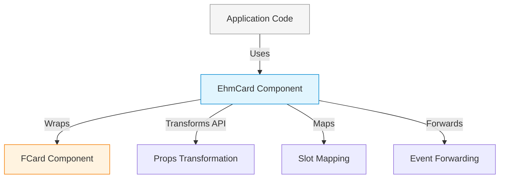

# Wrapper/Facade Pattern

## Overview

The **Wrapper Pattern** (also known as Facade) wraps an FKUI component and exposes a simplified, customized API for EHMDS consumers. The wrapper component:

- Uses FKUI components internally
- Exposes a different, simplified API
- Transforms props, slots, and events between the two APIs
- May add custom styling on top of FKUI

## When to Use

Use the Wrapper pattern when:

- You want a simpler API than FKUI provides
- You need to enforce specific prop combinations
- You want to hide FKUI complexity from consumers
- You need to change FKUI's default behavior

## Implementation: EhmCard

`EhmCard` wraps FKUI's `FCard` component:

```vue
<template>
  <FCard :id="id" :focus-ref="errorRef" :class="cardClasses">
    <template v-if="$slots.header" #header>
      <slot name="header" />
    </template>
    <slot />
    <template v-if="$slots.footer" #footer>
      <div class="ehm-card__footer">
        <slot name="footer" />
      </div>
    </template>
  </FCard>
</template>
```

## Architecture Diagram



## API Transformation Example

| EHMDS API | FKUI API | Notes |
|-----------|----------|-------|
| `variant="bordered"` | No equivalent | EHMDS-only variant |
| `hasError` | `focusRef` | Semantic mapping |
| `errorRef` | `focusRef` | Direct pass-through |
| `#header` slot | `#header` slot | Direct pass-through |
| `#footer` slot | `#footer` slot | Wrapped with div |

## Pros and Cons

**Pros:**

- Complete control over exposed API
- Can simplify complex FKUI APIs
- Can enforce best practices
- Can add EHMDS-specific features

**Cons:**

- Must maintain wrapper code
- FKUI updates may require wrapper updates
- Adds a layer of indirection
- More code than direct FKUI usage

## Code Example

```vue
<template>
  <!-- EHMDS Wrapper API - simpler than FKUI -->
  <EhmCard variant="elevated" :has-error="hasError" :error-ref="firstInputRef">
    <template #header>Card Title</template>
    <p>Card content</p>
    <template #footer>
      <button>Action</button>
    </template>
  </EhmCard>
</template>
```

Compared to using FKUI directly:

```vue
<template>
  <!-- FKUI API - more complex -->
  <FCard id="card-123" :focus-ref="firstInputRef">
    <template #header>Card Title</template>
    <p>Card content</p>
    <template #footer>
      <button>Action</button>
    </template>
  </FCard>
</template>
```
