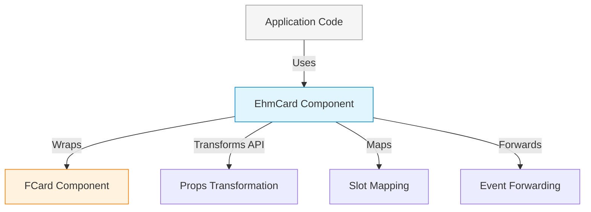

# Wrapper/Facade Pattern

## Overview

The **Wrapper Pattern** (also known as Facade) wraps an FKUI component and exposes a simplified, customized API for EHMDS consumers. The wrapper component:

- Uses FKUI components internally
- Exposes a different, simplified API
- Transforms props, slots, and events between the two APIs
- May add custom styling on top of FKUI

## When to Use

Use the Wrapper pattern when:

- You want a simpler API than FKUI provides
- You need to enforce specific prop combinations
- You want to hide FKUI complexity from consumers
- You need to change FKUI's default behavior

## Implementation: EhmCard

`EhmCard` wraps FKUI's `FCard` component:

```vue
<template>
  <FCard :id="id" :focus-ref="errorRef" :class="cardClasses">
    <template v-if="$slots.header" #header>
      <slot name="header" />
    </template>
    <slot />
    <template v-if="$slots.footer" #footer>
      <div class="ehm-card__footer">
        <slot name="footer" />
      </div>
    </template>
  </FCard>
</template>
```

## Architecture Diagram


```mermaid
graph TD
    App[Application Code] -->|Uses| EHMDS[EhmCard Component]
    EHMDS -->|Wraps| FKUI[FCard Component]
    EHMDS -->|Transforms API| Props[Props Transformation]
    EHMDS -->|Maps| Slots[Slot Mapping]
    EHMDS -->|Forwards| Events[Event Forwarding]

    style EHMDS fill:#e1f5fe,stroke:#0288d1
    style FKUI fill:#fff3e0,stroke:#f57c00
    style App fill:#f5f5f5,stroke:#999
```

## API Transformation Example

| EHMDS API | FKUI API | Notes |
|-----------|----------|-------|
| `variant="bordered"` | No equivalent | EHMDS-only variant |
| `hasError` | `focusRef` | Semantic mapping |
| `errorRef` | `focusRef` | Direct pass-through |
| `#header` slot | `#header` slot | Direct pass-through |
| `#footer` slot | `#footer` slot | Wrapped with div |

## Pros and Cons

**Pros:**

- Complete control over exposed API
- Can simplify complex FKUI APIs
- Can enforce best practices
- Can add EHMDS-specific features

**Cons:**

- Must maintain wrapper code
- FKUI updates may require wrapper updates
- Adds a layer of indirection
- More code than direct FKUI usage

## Risks & When NOT to Use

**Abstractions leak.** A wrapper around a design system is never a fully sealed
boundary — this is the Law of Leaky Abstractions (Spolsky): a wrapper over a
design system leaks. Upstream prop names, the error DOM that FKUI emits, the
accessibility structure (roles, `aria-*` wiring, focus management), and FKUI
breaking changes all bleed through the facade no matter how clean the EHMDS API
looks on the surface. Consumers who hit one of these leaks are forced to
understand both APIs, which is exactly the complexity the wrapper promised to
hide.

**The maintenance burden is ongoing and quietly erodes the headline benefit.**
Because the wrapper translates between two live APIs, it must be re-verified on
*every* FKUI release — a prop rename, a changed slot contract, or a new
accessibility requirement upstream can silently change what your wrapper
delivers. That recurring re-verification work is real cost, and over time it can
erode the "less code than direct FKUI usage" benefit the Cons list cites.

**Do not use Wrapper when:**

- You only want to restyle a component — use **Token Override** instead; it
  carries none of this translation surface.
- You want to add features to one component — use **Extension**, which preserves
  the FKUI API rather than replacing it.
- You need to combine multiple components — use **Composition**, which is built
  for orchestration rather than for hiding a single component.
- You need to translate between two different design systems' vocabularies — use
  an **Adapter/Bridge** that explicitly translates between two systems, not a
  facade that pretends to hide one. A facade obscures which system is really
  driving behaviour; an adapter makes the translation honest and visible.

## Code Example

```vue
<template>
  <!-- EHMDS Wrapper API - simpler than FKUI -->
  <EhmCard variant="elevated" :has-error="hasError" :error-ref="firstInputRef">
    <template #header>Card Title</template>
    <p>Card content</p>
    <template #footer>
      <button>Action</button>
    </template>
  </EhmCard>
</template>
```

Compared to using FKUI directly:

```vue
<template>
  <!-- FKUI API - more complex -->
  <FCard id="card-123" :focus-ref="firstInputRef">
    <template #header>Card Title</template>
    <p>Card content</p>
    <template #footer>
      <button>Action</button>
    </template>
  </FCard>
</template>
```

## Industry Context: Adapter Pattern

This pattern is an application of the **Adapter Pattern** from the Gang of Four's structural design patterns. The Wrapper component acts as an adapter between FKUI's interface and EHMDS's simplified interface—converting FKUI's API into a form that's more convenient for our specific use case.
